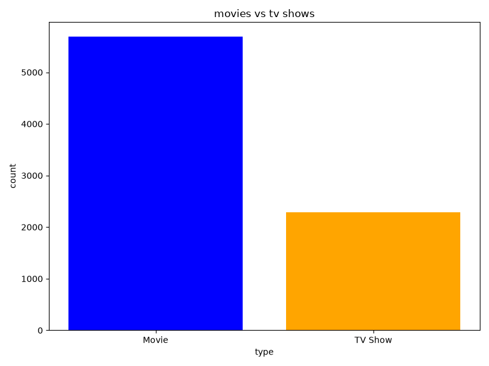
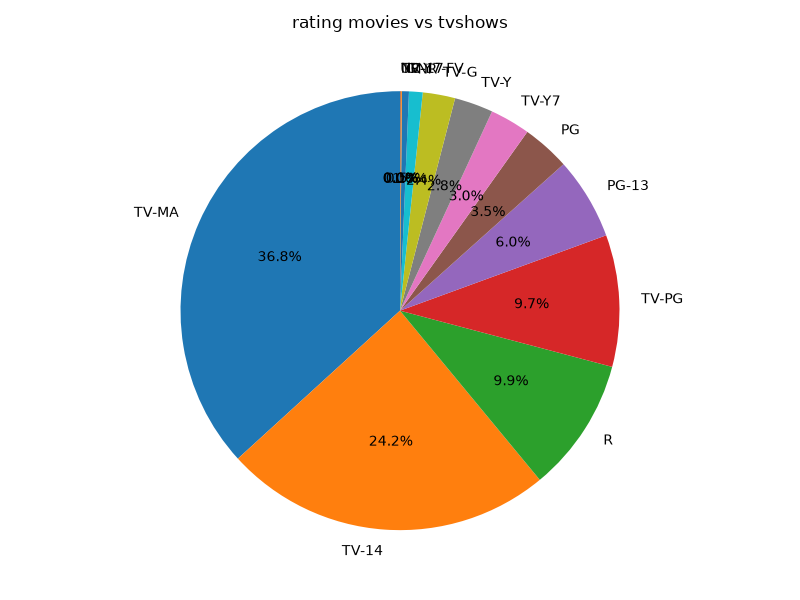
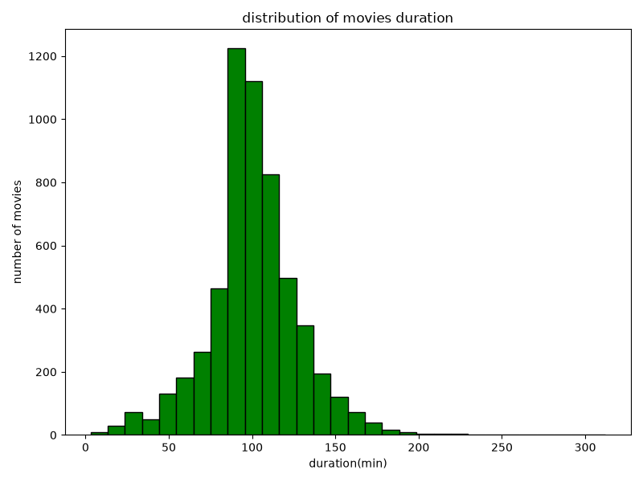
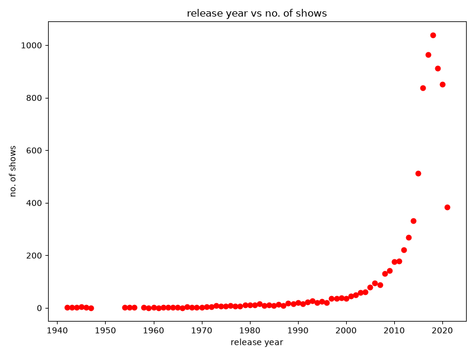
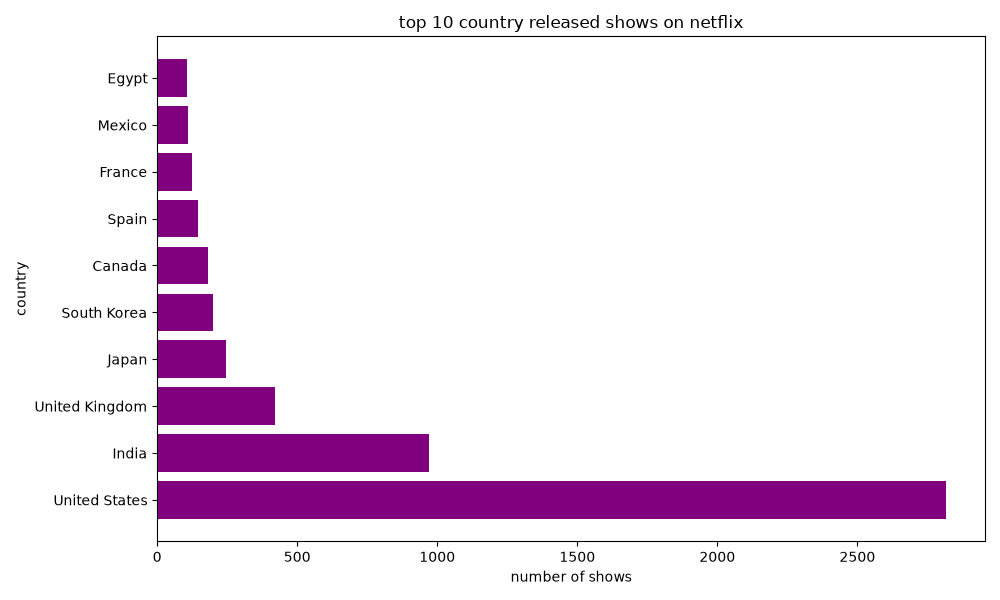
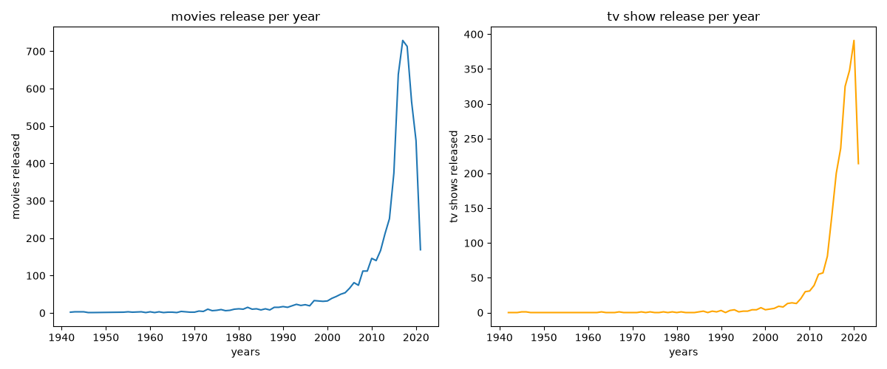

# 🎬 Netflix Data Analysis


## 📌 Overview

This project explores and analyzes Netflix's content library using **Python**, **Pandas**, and **Matplotlib**. The goal is to uncover insights about Netflix Movies and TV Shows through data cleaning, exploratory data analysis (EDA), and data visualization.

The project demonstrates fundamental data analysis techniques including:

* Data Cleaning
* Data Exploration
* Data Visualization
* Trend Analysis
* Insight Generation

---

## 🎯 Objectives

* Compare Movies and TV Shows available on Netflix.
* Analyze content ratings.
* Study movie duration patterns.
* Explore content release trends over time.
* Identify the top countries producing Netflix content.
* Compare yearly releases of Movies and TV Shows.

---

## 🛠️ Technologies Used

| Technology       | Purpose                  |
| ---------------- | ------------------------ |
| Python           | Programming Language     |
| Pandas           | Data Cleaning & Analysis |
| Matplotlib       | Data Visualization       |
| Jupyter Notebook | Development Environment  |

---

## 📂 Dataset

The dataset contains information about Netflix titles, including:

* Title Type
* Country
* Release Year
* Rating
* Duration
* Director
* Cast
* Genre Information

Dataset Used:

```text
data/netflix_titles.csv
```

---

## 🧹 Data Cleaning

Before analysis, the dataset was cleaned by removing rows containing missing values in important columns:

* Type
* Country
* Release Year
* Rating
* Duration

This ensured that the visualizations and insights were generated from reliable data.

---

## 📊 Visualizations

### 1️⃣ Movies vs TV Shows

Comparison of the total number of Movies and TV Shows available on Netflix.



---

### 2️⃣ Rating Distribution

Distribution of content ratings across Netflix titles.



---

### 3️⃣ Movie Duration Distribution

Analysis of movie durations using a histogram.



---

### 4️⃣ Release Year Trend

Number of Netflix titles released each year.



---

### 5️⃣ Top 10 Countries

Countries with the highest number of Netflix titles.



---

### 6️⃣ Movies vs TV Shows Yearly Comparison

Comparison of yearly releases between Movies and TV Shows.



---

## 🔍 Key Insights

### 📈 Content Distribution

* Movies significantly outnumber TV Shows on Netflix.

### 🌍 Country Analysis

* A small number of countries contribute a large share of Netflix content.

### 🎬 Duration Analysis

* Most movies fall within standard feature-film durations.

### 📅 Release Trends

* Content production has increased considerably over the years.

### ⭐ Rating Analysis

* Netflix offers content for a wide range of audiences and age groups.

---

## 📁 Project Structure

```text
NETFLIX-ANALYST/
│
├── charts/
│   ├── movie_duration_distribution.png
│   ├── movies_vs_tvshows.png
│   ├── movies_vs_tvshows_yearly.png
│   ├── rating_distribution.png
│   ├── release_year_trend.png
│   └── top_10_countries.png
│
├── data/
│   └── netflix_titles.csv
│
├── project.ipynb
├── requirements.txt
├── README.md
└── .gitignore
```

---

## 🚀 Getting Started

### Clone the Repository

```bash
git clone https://github.com/PooravMSharma/netflix-analyst.git
```

### Navigate to Project Directory

```bash
cd netflix-analyst
```

### Install Dependencies

```bash
pip install -r requirements.txt
```

### Run the Notebook

```bash
jupyter notebook
```

Open:

```text
project.ipynb
```

---

## 📋 Requirements

```text
pandas
matplotlib
jupyter
```

---

## 🎓 Skills Demonstrated

* Data Cleaning
* Data Wrangling
* Exploratory Data Analysis (EDA)
* Data Visualization
* Statistical Interpretation
* Business Insight Generation

---

## 🔮 Future Improvements

* Genre Analysis
* Director Analysis
* Actor Analysis
* Netflix Content Growth Dashboard
* SQL-Based Analysis
* Interactive Visualizations using Plotly
* Power BI Dashboard

---

## 👨‍💻 Author

### Poorav Sharma

BCA Student | Aspiring Data Analyst & AI Engineer

Currently learning:

* Python
* Pandas
* Matplotlib
* SQL
* Machine Learning

⭐ If you found this project interesting, consider giving it a star!
